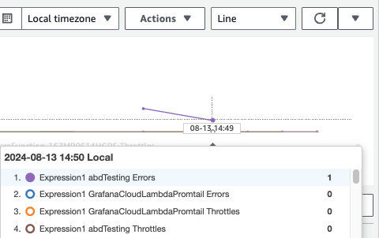

# Lambda Error Monitoring CloudFormation

A CloudFormation template for creating a CloudWatch alarm to monitor errors in AWS Lambda functions.  \
This template helps track and alert on error metrics across all Lambda functions in one region, ensuring quick responses to issues.

## Features

- **Error Monitoring**: Automatically tracks error metrics for all Lambda functions in a single region.
- **CloudWatch Alarms**: Sets up CloudWatch alarms to notify you of any errors, allowing for quick response and resolution.
- **Centralized Management**: Manage error monitoring for multiple Lambda functions from a single CloudFormation template.

## Setup Instructions

- **Deploy the CloudFormation Template**:
   - Go to the AWS Management Console.
   - Navigate to the CloudFormation service.
   - Create a new stack using the provided CloudFormation template.

## How to identify the failing Lambda function when receiving an email notification
1. **View Metrics in CloudWatch**:
   - Go to the CloudWatch service in the AWS Management Console.
   - Navigate to the **Metrics** --> **All metrics**.
   - Go to the **Graph Metrics** tab.
   - Use the dropdown menu on the right side **Add math**, then select **Search** --> **Lambda Throttles or Errors**.

2. **Analyze Error Metrics**:
   - This will display error counts per Lambda function in a graph.
   - Mouse over the graph to see the name of the Lambda function with errors.

        

## Usage
- **Monitoring**: Regularly check the CloudWatch metrics and alarms to stay informed about the health of your Lambda functions.
- **Alerts**: Configure notifications for CloudWatch alarms to receive alerts via email.

## Contributing
Contributions are welcome! Please submit a pull request or open an issue to discuss any changes.